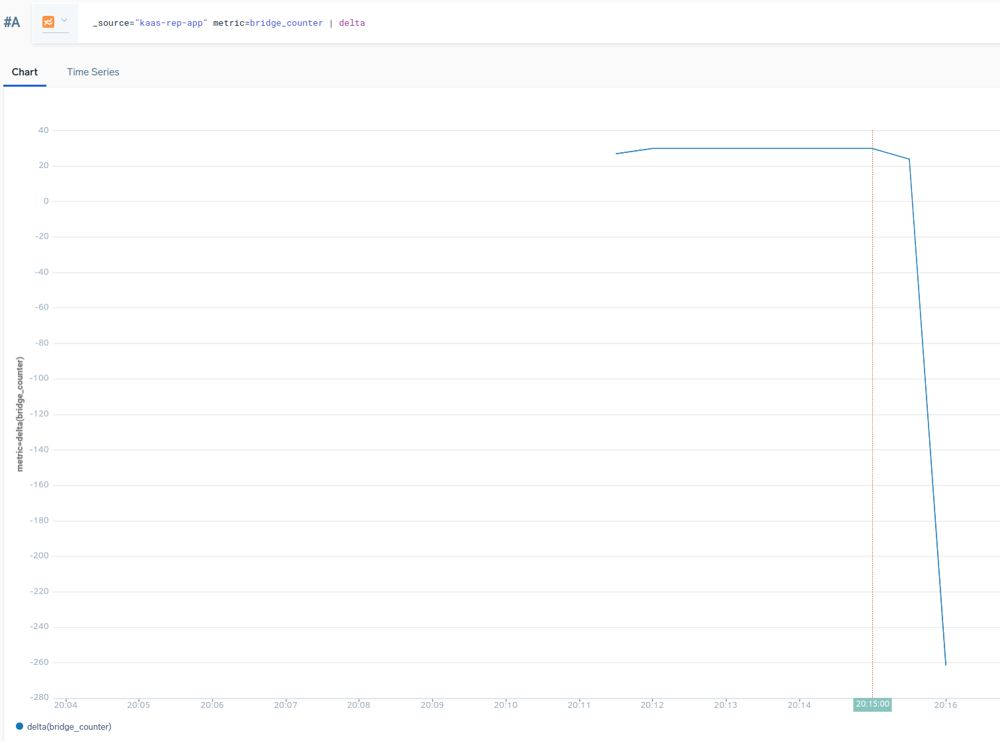

### How to build

    go build .

### How to run

    ./sumo-bridge -addr=<sumo-collector-url>
    Starting bridge
    bridge: sumo.go:121: collected metrics:  1
    
    metrics:
    # HELP bridge_counter The total number of processed events
    # TYPE bridge_counter counter
    bridge_counter 12

    ...

### How it works

It create a promethues registry and register all required metrics on it. Then it creates a background process to submit those metrics to Sumo collector periodically. The bridge is located at `pkg/bridge/sumo.go`.

Here is an example in the Sumologic dashboard -

